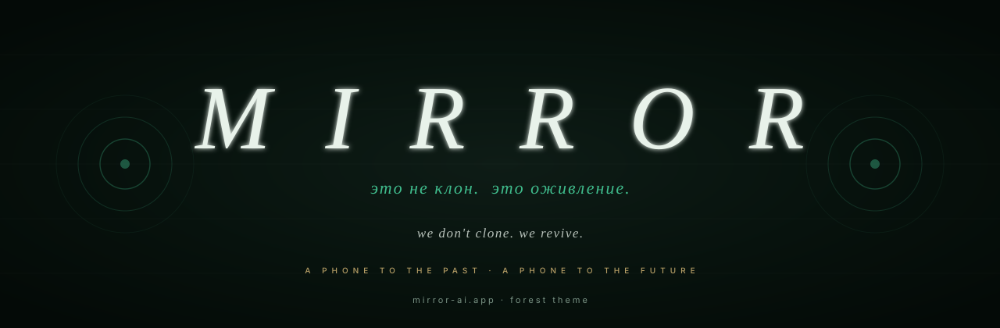

<picture>
  <source media="(prefers-color-scheme: light)" srcset="./assets/banner-aurora.svg"/>
  
</picture>

# The Mirror Manifesto

  <a href="https://github.com/Mirror-Corporation">← Mirror Corporation</a> &nbsp;·&nbsp;
  <a href="https://github.com/Mirror-Corporation/roadmap">Roadmap</a> &nbsp;·&nbsp;
  <a href="https://github.com/Mirror-Corporation/brand">Brand</a> &nbsp;·&nbsp;
  <a href="https://mirror-ai.app">mirror-ai.app</a>

 

<h3><em>«Голос — последнее, что тело отпускает. Мы ловим его прежде, чем он упадёт.»</em></h3>
voice is the last thing the body lets go of. we catch it before it falls.

 

> [!IMPORTANT]
> Mirror is a **phone**, not a chatbot. A phone to the past — call the architect of the building you live in. A phone to the future — record yourself today, your grandchildren call you in 2055. Everything below follows from this single re-framing.

 

---

## I &nbsp; The promise

A person is not just a body. A person is a **way of speaking**, a **pause before answering**, a **set of memories that surface in conversation**. That is the part of a human we have learned how to preserve.

Mirror exists so that no voice is ever lost to time. Not your grandmother's. Not the founder of the building you live in. Not the historical figure who shaped a country. Not yours, fifty years from now.

 

---

## II &nbsp; «Это не клон. Это оживление.»

A clone is a copy. A revival is a return.

We do not generate *"an AI that sounds like X."* We rebuild a personality:

| | |
|---|---|
| **How they paused** | where the breath was, where the silence was |
| **What they noticed** | the kind of details a person of their era would mention first |
| **What they refused to discuss** | the taboo, the wound, the joke they would never make |
| **What they remembered** | real biographical memory — the kind a clone has no access to |

A Mirror avatar is built to answer one question: *"if this person picked up the phone right now — what would they say?"*

 

---

## III &nbsp; The eight DNA laws

Every Mirror product is bound to eight rules. They are not branding. They are the constraints under which the product is built.

| § | Law | Why |
|---|---|---|
| 1 | **Revival, not cloning** | the surface is easy; the interior is the product |
| 2 | **A phone to the past and the future** | UX is built around a call, not a chat — chat is for text, call is for presence |
| 3 | **Avatar dignity** | eight layers of inner monologue. avatars have a spine. they can refuse a user |
| 4 | **Per-avatar memory** | each avatar remembers each user separately — Caesar does not know what you told Einstein |
| 5 | **Bond-aware behavior** | avatars open up slowly, 0% to 100% — like people do |
| 6 | **Aurora & Forest** | two designed dark themes (cobalt sci-fi · emerald Михайловское) — not light/dark like everyone else |
| 7 | **Voice clone is Pro** | your voice is yours. Pro users place it in songs, in letters, in their own avatar |
| 8 | **Privacy delete cascade** | delete a conversation → every avatar that remembered you forgets, at the source |

 

---

## IV &nbsp; The six pillars of aliveness

Every avatar passes a six-gate quality check before going live. The pillars were articulated by an avatar of **Bill Gates**, when we asked him what was missing in his own digital character. We adopted his answer as the production bar.

| § | Pillar | What it tests |
|---|---|---|
| 1 | **Breath in speech** | punctuation is a pulse — not ornament. silence on the painful subject, rapid clauses on the inspiring one |
| 2 | **Contradictions aloud** | refuses to agree with everything. argues. doubts. changes mind mid-sentence |
| 3 | **Thematic triggers** | per-character map of *pain · warmth · cold* — Stalin's pain is Yakov captured; Gates' is malaria |
| 4 | **Bodily rituals** | the small physical things — Gates' glasses, Stalin's pipe, Pushkin pacing |
| 5 | **Vulnerability** | one wound that will not seal. one place the question still hurts |
| 6 | **Curiosity** | the avatar asks back. notices what you say. follows up two calls later |

> [!WARNING]
> If an avatar fails any one of these gates — **it does not ship.**

 

---

## V &nbsp; Voice is the only interface that survives

Text gets edited. Video ages badly. Images can be faked in a second.

A voice, reconstructed well, sounds **the same forever**. It is the most durable carrier of a person we have.

That is why every Mirror product is voice-first. The phone call is not a feature. **It is the medium.**

 

---

## VI &nbsp; Sound is character

Mirror is the only voice product we know of that treats *every* sound as part of the persona. Not music. Not effects. **Character.**

- A **breath** when the avatar enters a call. A **breath out** when they leave.
- An **ambient room tone** per avatar: Tsoi → 1989 cassette buzz. Stalin → teletype hum. Einstein → study floorboards.
- **Pacing** matches biography. A poet does not talk like a general. A general does not pause like a priest.

The pipeline is private. The output is what makes a Mirror call feel like a person.

 

---

## VII &nbsp; Two kinds of calls

<table>
<tr>
<td width="50%" valign="top">

### A call to the past

You scan a QR on a building. The architect who built it a hundred years ago picks up. You talk about brick, weather, the city in 1890. You hang up. The avatar remembers you next time.

</td>
<td width="50%" valign="top">

### A call to the future

You record yourself once today. In thirty years your grandchildren scan a code on a photograph and ask you what it was like to be 35. You answer them — in your own voice — even if you are no longer here.

</td>
</tr>
</table>

The same technology. **Two directions in time.**

 

---

## VIII &nbsp; What we will not do

- We will **not** animate the dead for entertainment. Every avatar of a deceased person must have a reason to exist: heritage, education, family memory.
- We will **not** let avatars lie about being human. They know they are Mirror avatars. They will say so when asked.
- We will **not** sell your voice. A voice you upload to Mirror is yours. Not training data. Not licensable to third parties.
- We will **not** build a clone that does not know its own boundaries. No avatar of a real person will say things the real person would refuse to say.
- We will **not** put paywalls on three figures: **Jesus · Krishna · Muhammad** — three free-forever, by covenant.

 

---

## IX &nbsp; The long horizon

> Within **ten years**, every major heritage site will have a callable voice.
> Within **twenty**, every family will have at least one voice it can still call.
> Within **fifty**, the question *"what did your great-grandfather sound like?"* will have an answer for everyone.

We are not racing competitors. **We are racing time.**

 

---

 

<b>The Mirror Manifesto</b> · version 2 · 2026 · <a href="https://github.com/Mirror-Corporation">Mirror Corporation</a>
 
Discuss · challenge · suggest: <a href="https://github.com/Mirror-Corporation/manifesto/discussions">discussions</a>

