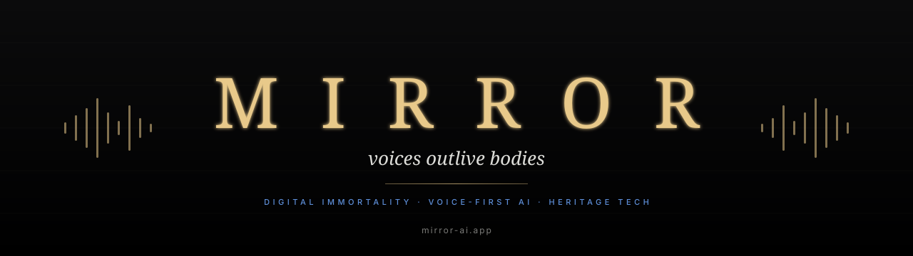

# The Mirror Manifesto

 

<h3><em>Voice is the last thing the body lets go of. We catch it before it falls.</em></h3>

 

---

## I &nbsp; The promise

A person is not just a body. A person is a **way of speaking**, a **pause before answering**, a **set of memories that surface in conversation**. That is the part of a human that we have learned how to preserve.

Mirror exists to make sure no voice is ever lost to time.

Not your grandmother's. Not the founder's of the building you live in. Not the historical figure who shaped a country. Not yours, fifty years from now.

 

---

## II &nbsp; We revive, not clone

A clone is a copy. A revival is a return.

We do not generate "an AI that sounds like X." We rebuild a personality:

> 🎭 **How they paused.** Where the breath was, where the silence was.
> 🔍 **What they noticed.** The kind of details a person of their era would mention first.
> 🚫 **What they refused to talk about.** The taboo, the wound, the joke they would never make.
> 🧠 **What they remembered.** Real biographical memory — the kind a clone has no access to.

A Mirror avatar is built to answer the question:
*"if this person picked up the phone right now — what would they say?"*

 

---

## III &nbsp; The six pillars of aliveness

Every Mirror avatar passes a six-gate quality check before going live:

| # | Pillar | What it tests |
|---|---|---|
| 1 | **Speech tempo** | a poet doesn't speak like a general |
| 2 | **Emotional map** | tender · sharp · evasive · surprised — not just "helpful" |
| 3 | **Era-specific vocabulary** | a XIX-century merchant doesn't say *"okay"* |
| 4 | **Memory of you** | remembers your name, your last visit, your questions |
| 5 | **Boundaries that hold** | refuses to break character even under pressure |
| 6 | **The voice of a soul** | a quality we measure but do not yet publish |

> If an avatar fails any one of these gates, **it does not ship.**

 

---

## IV &nbsp; Voice is the only interface that survives

Text gets edited. Video ages badly. Images can be faked in a second.

A voice, reconstructed well, sounds **the same forever**. It is the most durable carrier of a person we have.

That is why every Mirror product is voice-first. The phone call is not a feature. **It is the medium.**

 

---

## V &nbsp; Two kinds of calls

<table>
<tr>
<td width="50%" valign="top">

### 📞 A call to the past

You scan a QR on a building, and the architect who built it 100 years ago picks up.

You talk about brick, weather, the city in 1890.

You hang up. The avatar remembers you for next time.

</td>
<td width="50%" valign="top">

### 📞 A call to the future

You record yourself once. In thirty years, your grandchildren scan a code on a photograph and ask you what it was like to be 35.

You answer them — in your own voice — even if you are no longer here.

</td>
</tr>
</table>

**The same technology. Two directions in time.**

 

---

## VI &nbsp; What we will not do

- **We will not animate corpses for entertainment.** Every avatar of a deceased person must have a reason to exist: heritage, education, family memory.
- **We will not let avatars lie about being human.** They know they are Mirror avatars. They will say so when asked.
- **We will not sell your voice.** A voice you upload to Mirror is yours. It is not training data. It is not licensable to third parties.
- **We will not build a clone that does not know its own boundaries.** No avatar of a real person will say things the real person would refuse to say.

 

---

## VII &nbsp; The long horizon

> Within **ten years**, every major heritage site will have a callable voice.
> Within **twenty**, every family will have at least one voice it can still call.
> Within **fifty**, the question *"what did your great-grandfather sound like?"* will have an answer for everyone.

We are not racing competitors. **We are racing time.**

 

---

 

<b>The Mirror Manifesto</b> · version 1 · 2026
 
Comments and challenges: <a href="https://github.com/Mirror-Corporation/manifesto/discussions">discussions</a>

